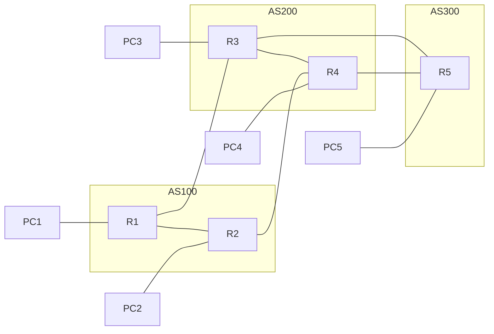

# Trabalho I – Redes: comparação de protocolos de roteamento

Laboratório com **5 roteadores FRRouting** distribuídos em **3 Sistemas Autônomos**, emulado com **Containerlab + Docker**. Sobre a mesma topologia física são executados, separadamente, três cenários: **OSPF**, **RIP** e **BGP**.

## Topologia



A topologia tem caminhos redundantes (ex.: R1→R3→R5 e R1→R2→R4→R5), permitindo observar a reconvergência dos protocolos quando um link cai.

## Endereçamento

| Rede | Prefixo | Endereços |
|---|---|---|
| R1–R2 | 10.0.12.0/24 | R1 .1, R2 .2 |
| R1–R3 | 10.0.13.0/24 | R1 .1, R3 .3 |
| R2–R4 | 10.0.24.0/24 | R2 .2, R4 .4 |
| R3–R4 | 10.0.34.0/24 | R3 .3, R4 .4 |
| R3–R5 | 10.0.35.0/24 | R3 .3, R5 .5 |
| R4–R5 | 10.0.45.0/24 | R4 .4, R5 .5 |
| Rede de acesso do Rn | 192.168.n.0/24 | Rn .1, PCn .10 |
| Loopback do Rn | 10.255.0.n/32 | router-id |

## Cenários

- **OSPF:** todos os roteadores em uma única área 0 (roteamento por estado de enlace, custo baseado em banda).
- **RIP v2:** todos os roteadores em um único domínio RIP (vetor de distância, métrica = saltos).
- **BGP:** eBGP entre os ASs (R1–R3, R2–R4, R3–R5, R4–R5) e iBGP dentro dos ASs (R1–R2, R3–R4) com `next-hop-self`.

Os cenários OSPF e RIP tratam a rede como um único domínio de roteamento interno; a divisão em ASs é explorada no cenário BGP.

## Requisitos

- Linux com Docker (serviço ativo)
- Containerlab (`bash -c "$(curl -sL https://get.containerlab.dev)"`)

## Como usar

```bash
./scripts/rodar.sh ospf      # ou rip / bgp
./scripts/verificar.sh       # tabelas de rotas + matriz de ping
./scripts/parar.sh           # derruba tudo
```

Acessar um roteador:

```bash
docker exec -it clab-redes-r1 vtysh
```

Comandos úteis no `vtysh`: `show ip route`, `show ip ospf neighbor`, `show ip rip status`, `show ip bgp summary`, `show ip bgp`.

Simular a queda de um link (ex.: R3–R5):

```bash
docker exec clab-redes-r3 ip link set eth3 down
docker exec clab-redes-r3 ip link set eth3 up
```

## Estrutura

```
topologia.clab.yml     topologia física (nós e links)
configs/ospf|rip|bgp/  daemons + frr.conf de cada roteador por cenário
configs/vtysh.conf
scripts/               subir, derrubar e verificar o laboratório
```
