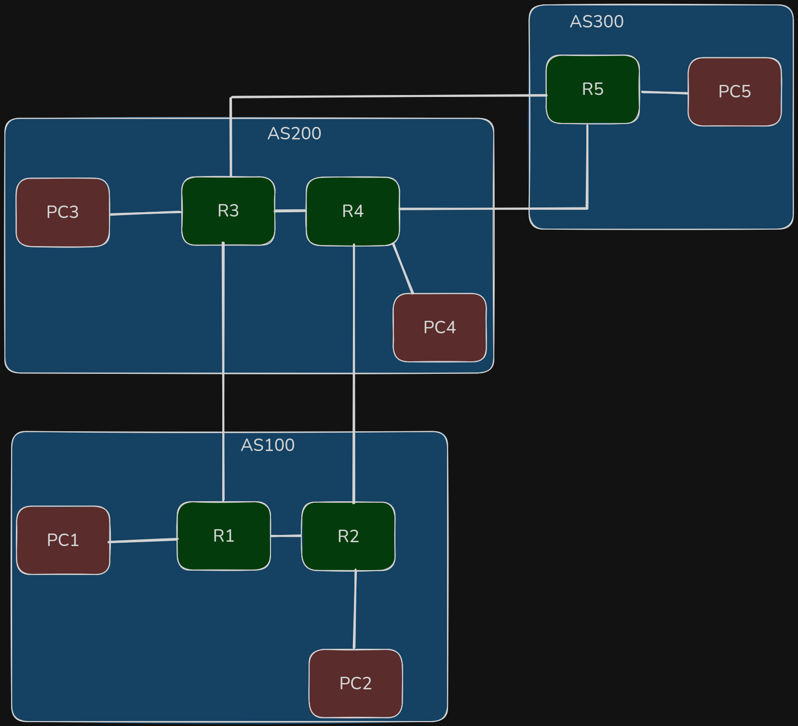
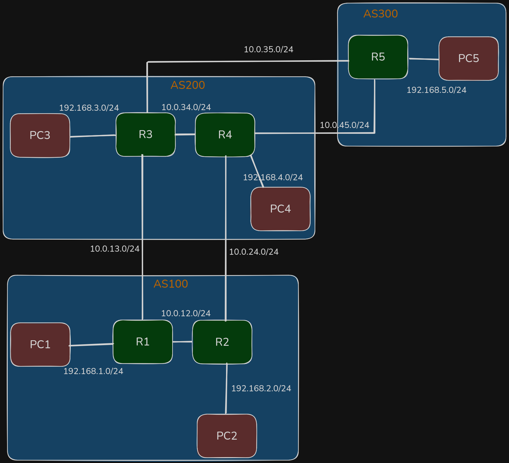
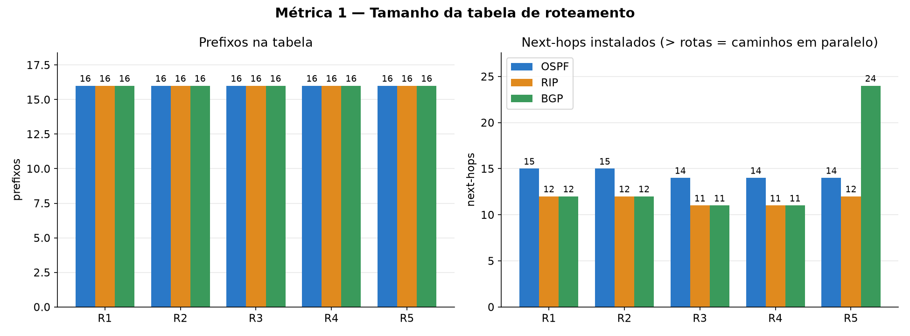
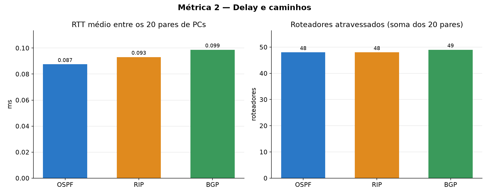
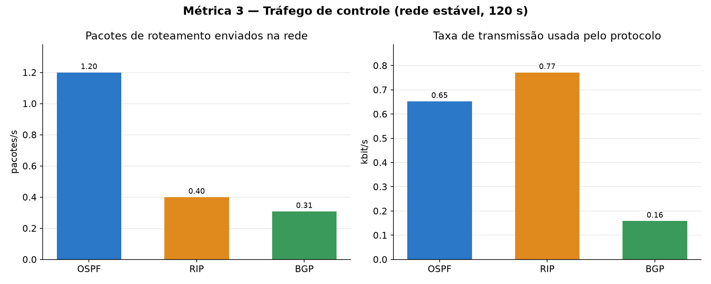
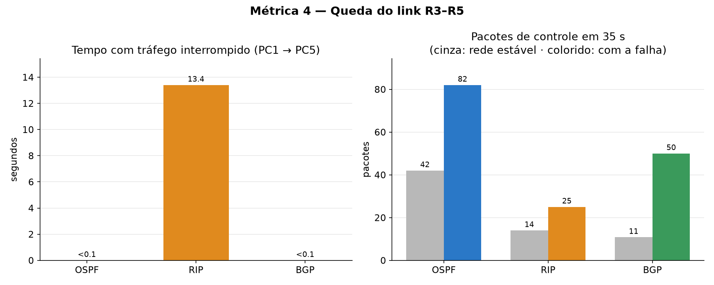

# Trabalho GA – Redes: Protocolos de roteamento

Laboratório com **5 roteadores FRRouting** distribuídos em **3 Sistemas Autônomos**, emulado com **Containerlab + Docker**. Sobre a mesma topologia física são executados, **um de cada vez**, três protocolos de roteamento: **OSPF**, **RIP** e **BGP**. Para cada protocolo são coletadas as métricas pedidas no enunciado e, ao final, gerados gráficos comparativos.

📹 **Vídeo de demonstração (docs/video-redes.mp4): **

https://github.com/user-attachments/assets/cd7fb304-a841-4203-9c32-7e42bb4a9364

---

## Topologia

### Física (quem está ligado a quem)



- 5 roteadores: **R1 e R2 no AS 100**, **R3 e R4 no AS 200**, **R5 no AS 300**
- 5 PCs, um em cada rede de acesso
- 6 links entre roteadores, com caminhos redundantes (ex.: PC1 → PC5 por R1→R3→R5 ou R1→R2→R4→R5)

Definida em `topologia.clab.yml`.

### Lógica (endereçamento e ASs)



| Rede | Prefixo | Endereços |
|---|---|---|
| R1–R2 | 10.0.12.0/24 | R1 .1 (eth1), R2 .2 (eth1) |
| R1–R3 | 10.0.13.0/24 | R1 .1 (eth2), R3 .3 (eth1) |
| R2–R4 | 10.0.24.0/24 | R2 .2 (eth2), R4 .4 (eth1) |
| R3–R4 | 10.0.34.0/24 | R3 .3 (eth2), R4 .4 (eth2) |
| R3–R5 | 10.0.35.0/24 | R3 .3 (eth3), R5 .5 (eth1) |
| R4–R5 | 10.0.45.0/24 | R4 .4 (eth3), R5 .5 (eth2) |
| Rede de acesso do Rn | 192.168.n.0/24 | Rn .1 (gateway), PCn .10 |
| Loopback do Rn | 10.255.0.n/32 | identificador do roteador (router-id) |

Regra: o link entre Rx e Ry é `10.0.xy.0/24`, e cada roteador usa o próprio número como final do IP. No total são **16 redes**.

Definida nos arquivos `configs/<protocolo>/r1.conf` a `r5.conf`.

---

## Cenários

| Protocolo | Tipo | Como foi configurado |
|---|---|---|
| **OSPF** | estado de enlace | todos os roteadores na área 0; métrica = custo dos links |
| **RIP v2** | vetor de distância | todos os roteadores no mesmo domínio; métrica = número de saltos |
| **BGP** | vetor de caminho | **eBGP** entre ASs (R1–R3, R2–R4, R3–R5, R4–R5) e **iBGP** dentro dos ASs (R1–R2, R3–R4) |

No OSPF e no RIP a rede é tratada como um único domínio interno; a divisão em ASs é usada no cenário BGP. As interfaces voltadas aos PCs são **passivas**: a rede é anunciada, mas nenhuma mensagem do protocolo é enviada para os PCs.

---

## Requisitos

- Linux com **Docker**
- **Containerlab** – instalação em <https://containerlab.dev/install>

Imagens usadas (baixadas automaticamente no primeiro uso):
- `quay.io/frrouting/frr:10.2.1` – roteadores
- `ghcr.io/hellt/network-multitool` – PCs e capturas com `tcpdump`

---

## Como usar

### 1. Subir o laboratório com um protocolo

```bash
./scripts/rodar.sh ospf        # ou: rip | bgp
```

O script derruba o laboratório anterior, aponta `configs/atual` para a pasta do protocolo escolhido e sobe os 10 containers com o Containerlab. Aguarde **cerca de 1 minuto** para a rede estabilizar.

### 2. Verificar o roteamento

```bash
./scripts/verificar.sh
```

Mostra a tabela de rotas de cada roteador e uma matriz de ping entre todos os PCs (esperado: **OK** em todas as posições).

### 3. Coletar as métricas

Na ordem abaixo, um script de cada vez. O `falha_link.sh` deve ser o **último**, porque altera a rede.

```bash
./metricas/tabela_rotas.sh     # alguns segundos
./metricas/delay.sh            # ~1 min
./metricas/controle.sh         # 2 min
./metricas/falha_link.sh       # ~40 s
```

Cada script detecta o protocolo em uso e grava `resultados/<metrica>_<protocolo>.csv`. Repita os passos 1 a 3 para os três protocolos.

### 4. Gerar os gráficos

```bash
python metricas/graficos.py
```

Lê os 12 CSVs de `resultados/` e gera 4 imagens em `graficos/`.

### 5. Encerrar

```bash
./scripts/parar.sh
```
---

## Métricas

| Item do enunciado | Script | Como é medido |
|---|---|---|
| Tamanho da tabela de roteamento | `tabela_rotas.sh` | conta as rotas em uso no `show ip route` de cada roteador |
| Quantidade de pacotes de roteamento | `controle.sh` | captura com `tcpdump`, por 120 s, os pacotes do protocolo enviados por cada roteador |
| Taxa de transmissão do protocolo | `controle.sh` | soma os bytes desses pacotes (convertido para kbit/s no gráfico) |
| Delay | `delay.sh` | RTT de 10 pings entre cada um dos 20 pares de PCs |
| Comportamento em mudança da topologia | `falha_link.sh` | derruba o link R3–R5 com um ping PC1→PC5 rodando (10/s) e mede o tempo de interrupção |

Filtros de captura: OSPF = protocolo IP 89, RIP = UDP 520, BGP = TCP 179.

---

## Resultados

### 1. Tamanho da tabela de roteamento



Os três protocolos levaram todos os roteadores às **16 redes** da topologia. A diferença está nos caminhos instalados: o **OSPF** usa caminhos de mesmo custo em paralelo em todos os roteadores; o **RIP** instala só um caminho por destino; o **BGP** usa caminhos em paralelo apenas no R5, cujos dois vizinhos (R3 e R4) pertencem ao mesmo AS.

### 2. Delay



RTT médio praticamente igual nos três (~0,065–0,068 ms), com as faixas de variação sobrepostas. Nesta topologia os protocolos escolhem caminhos com o mesmo número de roteadores e, sem atraso real nos links, o delay depende basicamente do número de saltos.

### 3. Tráfego de controle



- **OSPF**: mais pacotes (hellos a cada 10 s), porém pequenos (68 bytes).
- **RIP**: menos pacotes, porém maiores (cada atualização, a cada ~30 s, carrega a tabela), resultando na **maior taxa**. O tamanho cresce com o número de rotas, o que limita a escalabilidade.
- **BGP**: o mais econômico nos dois — após trocar as rotas, envia apenas keepalives a cada 60 s.

### 4. Queda do link R3–R5



- **OSPF** e **BGP**: tráfego restabelecido em menos de 0,1 s. O OSPF conhece a topologia completa e recalcula na hora; o BGP já tinha a rota alternativa guardada.
- **RIP**: 13,4 s sem tráfego (28,2 s em outra execução). Ele guarda só a melhor rota; ao perdê-la, precisa esperar a próxima atualização periódica do vizinho (até 30 s).
- Os três geram uma rajada de mensagens de controle para reagir à falha.

---

## Estrutura

```
topologia.clab.yml        topologia física (nós e links)
configs/
  ospf/ rip/ bgp/         daemons + r1.conf..r5.conf de cada protocolo
  vtysh.conf
  atual -> <protocolo>    atalho criado pelo rodar.sh (não versionado)
scripts/
  rodar.sh                sobe o laboratório com um protocolo
  verificar.sh            tabelas de rotas + matriz de ping
  parar.sh                derruba o laboratório
metricas/
  tabela_rotas.sh         tamanho da tabela de roteamento
  delay.sh                delay
  controle.sh             pacotes de roteamento e taxa de transmissão
  falha_link.sh           comportamento em mudança da topologia
  graficos.py             gráficos comparativos (critério 7)
resultados/               CSVs gerados pelas métricas
graficos/                 PNGs gerados pelo graficos.py
docs/                     desenhos da topologia
```
